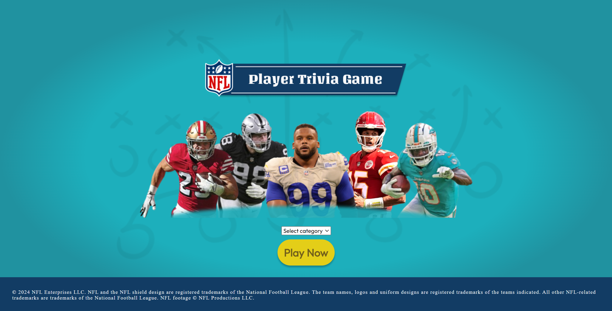
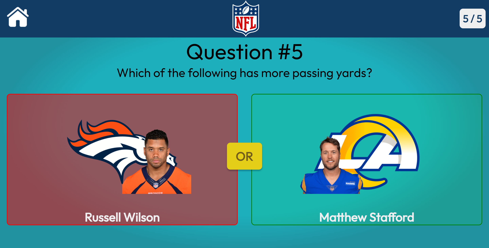
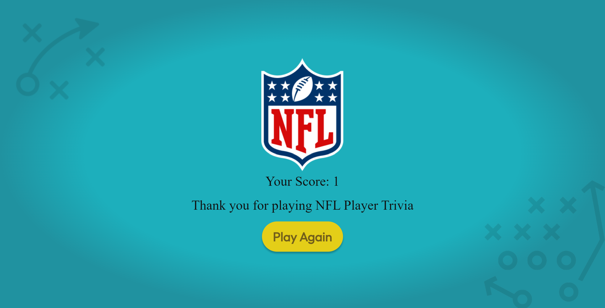

# NFL Player Trivia Game

## Screenshots

- Home Page: 
- Game Page: 
- End Page: 

This project is a trivia game where players can test their knowledge about NFL players. It utilizes React for the frontend and React Router for navigation.

## Installation

1. Clone the repository:

    ```bash
    git clone <repository_url>
    cd nfl-player-trivia-game
    ```

2. Install dependencies:

    ```bash
    npm install
    ```

3. Start the development server:

    ```bash
    npm start
    ```

## Usage

Once the development server is running, open your browser and navigate to `http://localhost:3000` to play the game.

## Features

- Multiple-choice questions about NFL players' statistics.
- Navigation between different pages using React Router.
- Responsive design for various screen sizes.

## Contributing

Contributions are welcome! If you find any bugs or have suggestions for improvement, please open an issue or submit a pull request.

## License

This project is licensed under the [MIT License](LICENSE).
